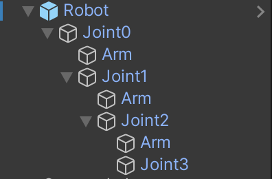
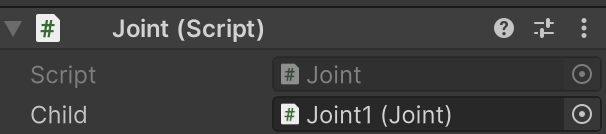

# chat gpt 를 이용한 unity 팔 움직이기

텍스트: 1.Unity/Unreal/Game 관련Project

# 구현 목표

구현하려는 바는 간단하다.

목소리로 “~~를 주워줘”, “~~를 버려줘”, “~~를 어디로 옮겨줘”와 같이, 특정한 명령어를 인식하고,

이 밖에도 사용자가 질문을 하면(ex, 바퀴는 어떻게 만드니? 등 ), 그것에 대한 답변을 해주는 프로젝트를 제작하고 싶었다.

정리하자면 아래와 같을듯 하다

<aside>
👉 기계팔 동작에 관련된 요청은 수행, 그렇지 않은 경우에는 요청에 대한 적절한 정보를 제공

</aside>

먼저 기계팔을 만들기 위한 간단한 Inverse Kinematic을 구현해야 한다.

## Inverse Kinematic

관절의 움직임을 지정해주는 Forward Kinematic 과는 반댓말이다. **원하는 위치에 도달하기 위해 관절 공간의 위치를 변동시켜주는 것**이다**.**



Inverse Kinematic 코드에 앞서, 로봇팔의 구조는 다음과 같다. 총 4개의 관절로 이루어져 있지만, 마지막 관절은 End Effector이다. 즉 앞으로 로봇의 손 역할을 할 부분이다.



각 Joint 는 다음 자식 Joint를 가진다. Joint Script는 다음과 같이 간단하게 구성되어 있다.

```cpp
using UnityEngine;

public class Joint : MonoBehaviour
{
    public Joint m_child;

    public Joint GetChild()
    {
        return m_child;
    }

    public void Rotate(Vector3 eulerAngles)
    {
        transform.Rotate(eulerAngles);
    }
}
```

자신의 클래스를 자식으로 가지며, 들어오는 eulerAngle 값에 따라서 회전하는 코드만을 가진다.

이제 이를 관리하는 IKManager를 보자

```cpp
using System.Collections;
using System.Collections.Generic;
using UnityEngine;

public class IKManager : MonoBehaviour
{
    // Root of the armature
    public Joint m_root;
    //End Effector
    public Joint m_end;
    public GameObject m_target;
    public float m_threshold = 0.05f;

    public float m_rate = 10.0f;

    public int m_steps = 20;

    float CalculateSlope(Joint _joint, Vector3 axis)
    {
        float deltaTheta = 0.01f;
        float distance1 = GetDistance(m_end.transform.position, m_target.transform.position);
        _joint.Rotate(axis * deltaTheta);

        float distance2 = GetDistance(m_end.transform.position, m_target.transform.position);
        _joint.Rotate(axis * -deltaTheta);

        return (distance2 - distance1) / deltaTheta;
    }

    private void Update()
    {
        if (m_target == null) return;
        for (int i = 0; i < m_steps; ++i)
        {
            if (GetDistance(m_end.transform.position, m_target.transform.position) > m_threshold)
            {
                Joint current = m_root;
                while (current != null)
                {
                    Vector3[] axes = new Vector3[] { Vector3.right, Vector3.up, Vector3.forward };
                    foreach (Vector3 axis in axes)
                    {
                        float slope = CalculateSlope(current, axis);
                        current.Rotate(axis * -slope * m_rate);
                    }
                    current = current.GetChild();
                }
            }
        }
    }

    float GetDistance(Vector3 _point, Vector3 _point2)
    {
        return Vector3.Distance(_point, _point2);
    }
}

```

변수에 대해 먼저 설명하자면 
    **Joint** **m_root** - 루트 조인트를 의미하한다
    **Joint** **m_end** - 끝 조인트 즉 엔드 이펙터를 의미한다
    **GameObject** **m_target** - 도달 할 목표 지점을 의미한다
    **float** **m_threshold** - 목표값 까지의 허용 오차값이다
    **float** **m_rate** - 회전 속도를 설정하는 값이다. 
    **int** **m_steps** - for문에 사용할 IK 계산 스탭 수이다.

**CalculateSlope(Joint, Vector3)** 함수에서는 Update 에서 넘겨받은 current joint와 목표 지점 사이의 기울기를 구한 후, 소량 이동시켜 주는 함수이다.

**GetDistance(Vector3, Vector3)**는 말 그대로 거리 구하는 함수이고,

**Update** 함수에서는 조인트 체인을 따라서 회전→계산→이동 을 반복한다.

IK로봇팔 테스트 결과는 다음 gif를 참고한다.


## GPT-4-Turbo , Whisper - 1

1단계는 끝이 났고 이제 명령을 처리해줄 GPT-4-Turbo와 음성을 인식해서 텍스트로 변환해 줄 Whisper - 1을 유니티에서 사용해 봐야한다.

**여기부턴 코드가 조금 길어지니 중요한 부분만 기술한다. 자세한 코드는 github를 참조하자.**

### gpt

먼저 gpt를 unity에서 사용할 수 있게 설정하고, 프롬포팅하는 부분이다

```cpp
private OpenAIApi openai = new OpenAIApi();

private List<ChatMessage> messages = new List<ChatMessage>();
private string prompt = "You are controlling a robotic arm. The arm can perform the following actions: '[object_name] move to [object_name]', 'pick up [object_name]', 'drop [object_name]'. Insert object name. Respond with the exact command based on the user's request. If the request is not related to robotic arm actions, provide relevant information based on the user's request.User: {0}Response:";

public async Task<string> SendMessageToChatGPT(string userInput)
{
    var newMessage = new ChatMessage()
    {
        Role = "user",
        Content = userInput
    };

    if (messages.Count == 0) newMessage.Content = prompt + "\n" + userInput; 

    messages.Add(newMessage);

    // Complete the instruction
    var completionResponse = await openai.CreateChatCompletion(new CreateChatCompletionRequest()
    {
        Model = "gpt-4-turbo",
        Messages = messages
    });

    if (completionResponse.Choices != null && completionResponse.Choices.Count > 0)
    {
        var message = completionResponse.Choices[0].Message;
        message.Content = message.Content.Trim();

        messages.Add(message);
        return message.Content;
    }
```

 위 코드가 gpt-4-turbo를 불러오고, 프롬포팅 후 비동기를 통해 대답을 받아온후 리턴하는 코드이다. (API키는 맥북 기준 ~/.openai/auth.json에 작성한다.)

프롬포팅만 보자면

```
"You are controlling a robotic arm.
 The arm can perform the following actions:
  '[object_name] move to [object_name]', 'pick up [object_name]', 
  'drop [object_name]' and etc... Insert object name. 
   The important thing is you must answer simplify that like above examples.
   Respond with the exact command based on the user's request. 
   If the request is not related to robotic arm actions, 
   provide relevant information based on the user's request.";
```

그냥 예시 몇개 알려주고 저런식으로 간략하게 대답하되, 다른 질문이 들어오면 알고있는 정보를 제공하라는 것이다.

이 함수는 

```
    enum Mode
    {
        move,pick,drop,none
    }
...(생략)
    #region string_ver
    public async Task<string> MoveArmBasedOnCommand(string text)
    {
        string command = text;
        string response = await chatGptController.SendMessageToChatGPT(command);

        Debug.Log(response);
        if (response != null)
        {
            if (response.Contains("move to"))
            {
                _hand.GetComponent<Collider>().enabled = true; // ?????? ??????
                string[] parts = response.Split(new string[] { " move to " }, System.StringSplitOptions.None);
                if (parts.Length == 2)
                {
                    string objectNameA = parts[0].Trim();
                    string objectNameB = parts[1].Trim();
                    GameObject objectA = GameObject.Find(objectNameA);
                    GameObject objectB = GameObject.Find(objectNameB);
                    if (objectA != null && objectB != null)
                    {
                        // Step 1: Move to objectA to pick it up
                        _mode = Mode.pick;
                        ikManager.m_target = objectA;
                        _hand.AttackMode(true);

                        // Wait until the object is picked up
                        StartCoroutine(WaitForPickup(objectB));
                    }
	                  ....(생략)
                    return response;
    
                    }
```

처음 gpt를 불러오고 답을 받아오던 함수에서 await를 통해 답변을 대기하고, string을 리턴해준다. 

명령에 따라서 Mode를 등록해주고, 슬라이싱해서 object를 찾은 후 그 오브젝트를 대상으로 명령을 수행하는 것이다. 이 return값은 whisper 쪽에서 사용하게 된다.

### whisper

```
       private async void EndRecording()
        {
            message.text = "Transcripting...";

            byte[] data = SaveWav.Save(fileName, clip);
            
            var req = new CreateAudioTranscriptionsRequest
            {
                FileData = new FileData() {Data = data, Name = "audio.wav"},
                // File = Application.persistentDataPath + "/" + fileName,
                Model = "whisper-1",
                Language = "ko"
            };
            var res = await openai.CreateAudioTranscription(req);

            progressBar.fillAmount = 0;
            
            string ans = await agc.MoveArmBasedOnCommand(res.Text);
            recordButton.enabled = true;
            message.text = ans;
        }
```

이전의 MoveArmBasedOnCommand return 값은 여기서 사용된다.

다음 영상이 이번 프로젝트 1차 프로토타입 제작본이다. 먼저 언어와 모델을 설정해 준 후, 여기서는 답변을 화면에 띄워주는 식이다. 인식한 말은
`string ans = await agc.MoveArmBasedOnCommand(res.Text);`

를 통해서 전달되고 받아온 값을 띄워주는 식이다.

# 결과

[1차본.mov](images/%25E1%2584%258E%25E1%2585%25A1%25E1%2584%2587%25E1%2585%25A9%25E1%2586%25AB.mov)

# 개선사항

현재는 약 4가지의 간단한 명령만을 수행하지만, Mode에 여러가지를 추가하면 정말 많은 기능을 수행할 수 있을거 같다. 또한 굳이 로봇팔 기반이 아닌 object를 직접 움직이는 방식을 택한다면 코드도 많이 간소화 되고 좋을듯 하다.
